# DeepLabV3-Plus (Ongoing)

[](https://tensorflow.org/)
[](https://mybinder.org/v2/gh/deepwrex/DeepLabV3-Plus/augmentations)
[](http://hits.dwyl.com/lattice-ai/DeepLabV3-Plus)

Tensorflow 2.2.0 implementation of DeepLabV3-Plus architecture as proposed by the paper [Encoder-Decoder with Atrous Separable
Convolution for Semantic Image Segmentation](https://arxiv.org/pdf/1802.02611.pdf).

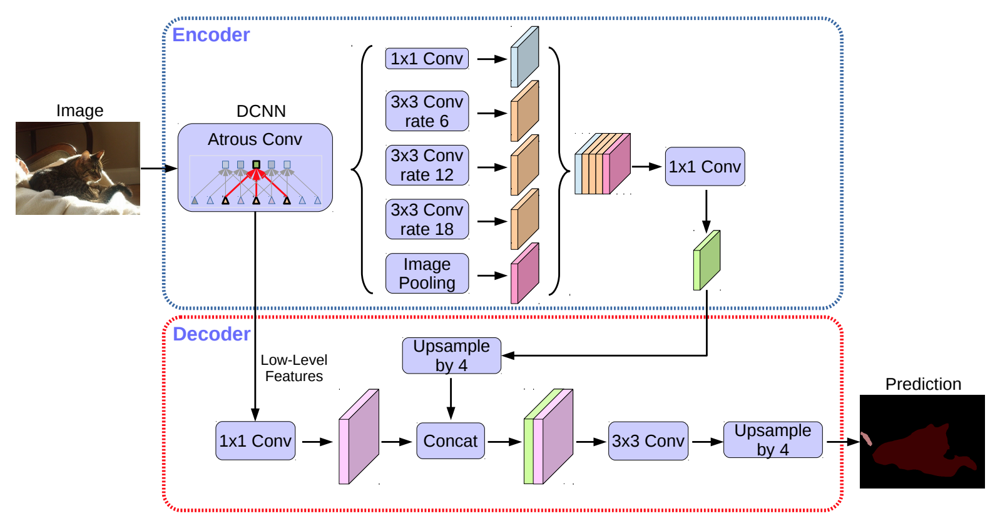

**Project Link:** [https://github.com/deepwrex/DeepLabV3-Plus/projects/](https://github.com/deepwrex/DeepLabV3-Plus/projects/).

**Experiments:** [https://app.wandb.ai/19soumik-rakshit96/deeplabv3-plus](https://app.wandb.ai/19soumik-rakshit96/deeplabv3-plus).

Model Architectures can be found [here](./models.md).

## Setup Datasets

- **CamVid**
    
    ```shell script
    cd dataset
    bash camvid.sh
    ```

- **Multi-Person Human Parsing**

    Register on [https://www.kaggle.com/](https://www.kaggle.com/).

    Generate Kaggle API Token

    ```shell script
    bash download_human_parsing_dataset.sh <kaggle-username> <kaggle-key>
    ```


## Code to test Model

```python
from deeplabv3plus.model.deeplabv3_plus import DeeplabV3Plus

model = DeepLabV3Plus(backbone='resnet50', num_classes=20)
input_shape = (1, 512, 512, 3)
input_tensor = tf.random.normal(input_shape)
result = model(input_tensor)  # build model by one forward pass
model.summary()
```

## Training

Use the trainer.py script as documented with the help description below:
```
usage: trainer.py [-h] [--wandb_api_key WANDB_API_KEY] config_key

Runs DeeplabV3+ trainer with the given config setting.

Registered config_key values:
  camvid_resnet50
  human_parsing_resnet50

positional arguments:
  config_key            Key to use while looking up configuration from the CONFIG_MAP dictionary.

optional arguments:
  -h, --help            show this help message and exit
  --wandb_api_key WANDB_API_KEY
                        Wandb API Key for logging run on Wandb.
                        If provided, checkpoint_dir is set to wandb://
                        (Model checkpoints are saved to wandb.)
```

### If you want to use your own custom training configuration, you can define it in the following way:

- #### Define your configuration in a python dictionary as follows:
`config/camvid_resnet50.py`

```python
#!/usr/bin/env python

"""Module for training deeplabv3plus on camvid dataset."""

from glob import glob

import tensorflow as tf


# Sample Configuration
CONFIG = {
    # We mandate specifying project_name and experiment_name in every config
    # file. They are used for wandb runs if wandb api key is specified.
    'project_name': 'deeplabv3-plus',
    'experiment_name': 'camvid-segmentation-resnet-50-backbone',

    'train_dataset_config': {
        'images': sorted(glob('./dataset/camvid/train/*')),
        'labels': sorted(glob('./dataset/camvid/trainannot/*')),
        'height': 512, 'width': 512, 'batch_size': 8
    },

    'val_dataset_config': {
        'images': sorted(glob('./dataset/camvid/val/*')),
        'labels': sorted(glob('./dataset/camvid/valannot/*')),
        'height': 512, 'width': 512, 'batch_size': 8
    },

    'strategy': tf.distribute.OneDeviceStrategy(device="/gpu:0"),
    'num_classes': 20, 'backbone': 'resnet50', 'learning_rate': 0.0001,

    'checkpoint_dir': "./checkpoints/",
    'checkpoint_file_prefix': "deeplabv3plus_with_resnet50_",

    'epochs': 100
}
```

- #### Save this file inside the configs directory. (As hinted in the file path above)
- #### Register your config in the `__init.py__` module like below:
`config/__init__.py`


```python
#!/usr/bin/env python
# -*- coding: utf-8 -*-

"""__init__ module for configs. Register your config file here by adding it's
entry in the CONFIG_MAP as shown.
"""

import config.camvid_resnet50
import config.human_parsing_resnet50


CONFIG_MAP = {
    'camvid_resnet50': config.camvid_resnet50.CONFIG,  # the config file we defined above
    'human_parsing_resnet50': config.human_parsing_resnet50.CONFIG  # another config
}

```
- #### Now you can run the trainer script like so (using the `camvid_resnet50` config key we registered above):
```bash
./trainer.py camvid_resnet50 --wandb_api_key <YOUR_WANDB_API_KEY>
```
or, if you don't need wandb logging:
```bash
./trainer.py camvid_resnet50
```

## Inference

Sample Inference Code:

```python
model_file = './dataset/deeplabv3-plus-human-parsing-resnet-50-backbone.h5'
train_images = glob('./dataset/instance-level_human_parsing/Training/Images/*')
val_images = glob('./dataset/instance-level_human_parsing/Validation/Images/*')
test_images = glob('./dataset/instance-level_human_parsing/Testing/Images/*')


def plot_predictions(images_list, size):
    for image_file in images_list:
        image_tensor = read_image(image_file, size)
        prediction = infer(
            image_tensor=image_tensor,
            model_file=model_file
        )
        plot_samples_matplotlib(
            [image_tensor, prediction], figsize=(10, 6)
        )

plot_predictions(train_images[:4], (512, 512))
```

## Results

### Multi-Person Human Parsing

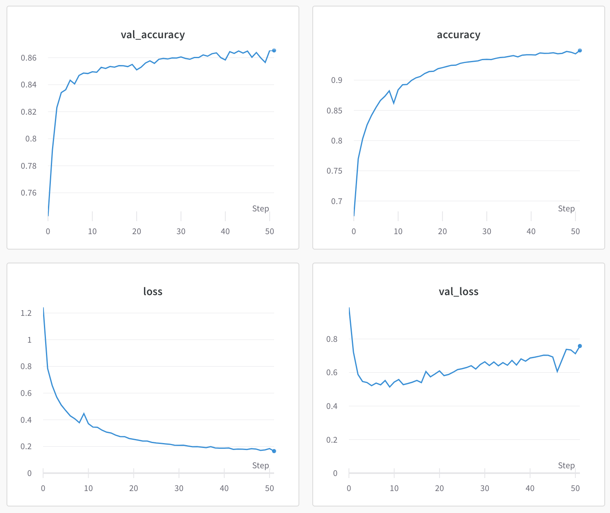

#### Training Set Results

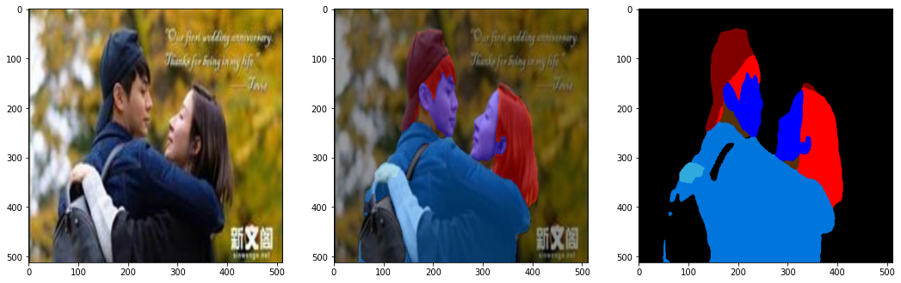

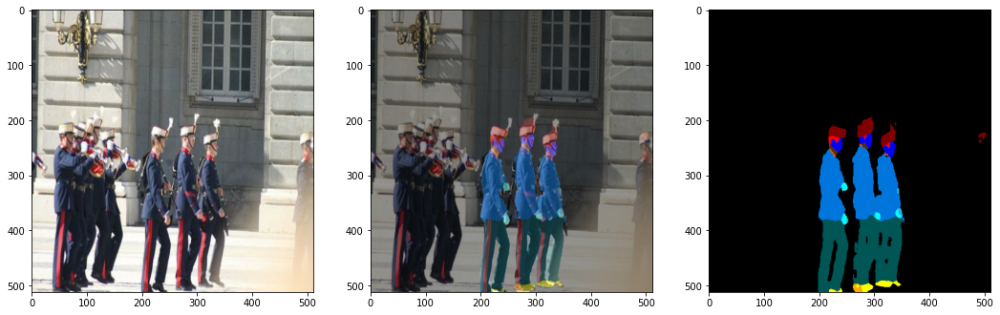

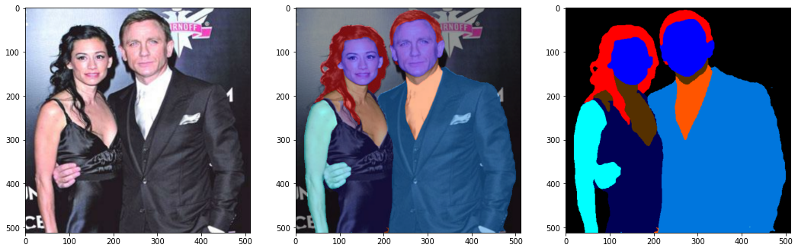

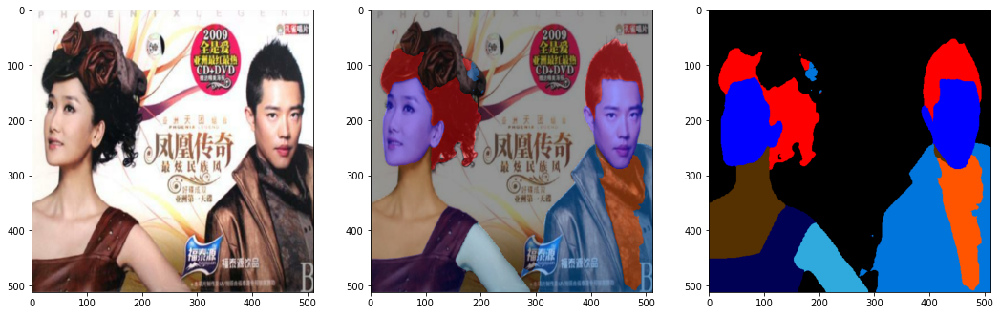

#### Validation Set Results

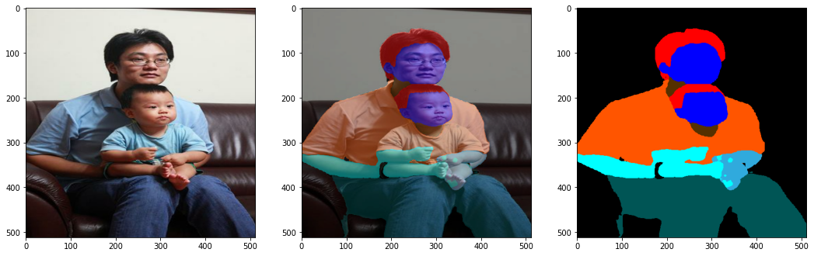

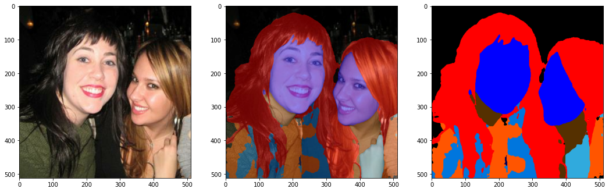

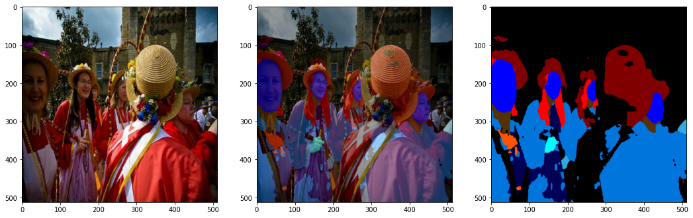

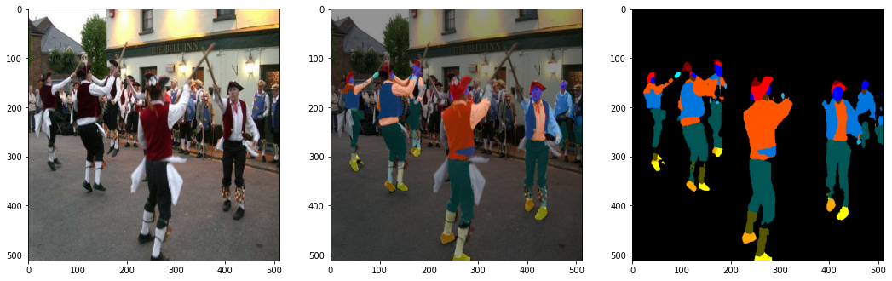

#### Test Set Results

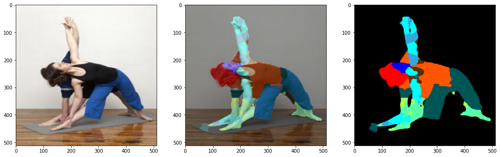

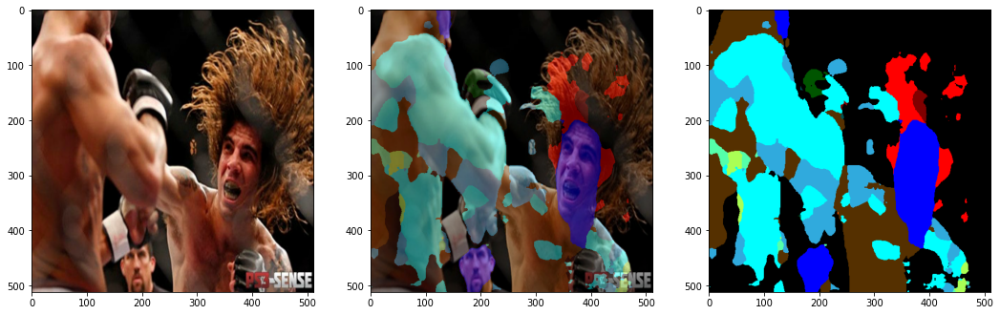

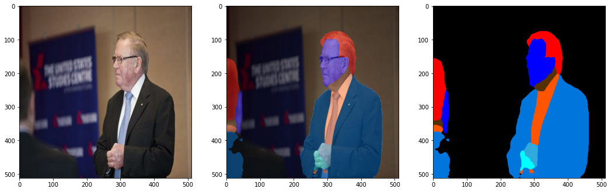

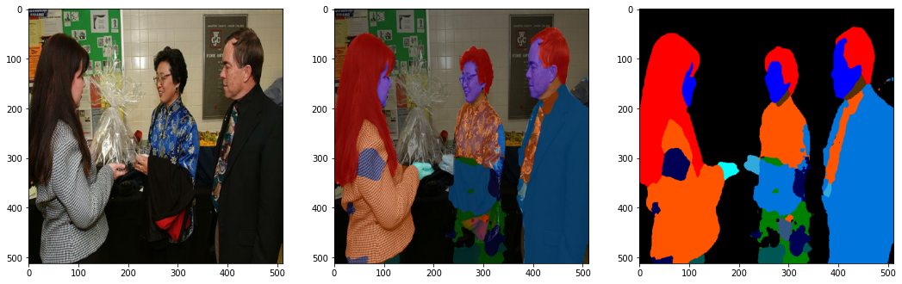

## Citation

```
@misc{1802.02611,
    Author = {Liang-Chieh Chen and Yukun Zhu and George Papandreou and Florian Schroff and Hartwig Adam},
    Title = {Encoder-Decoder with Atrous Separable Convolution for Semantic Image Segmentation},
    Year = {2018},
    Eprint = {arXiv:1802.02611},
}
```
